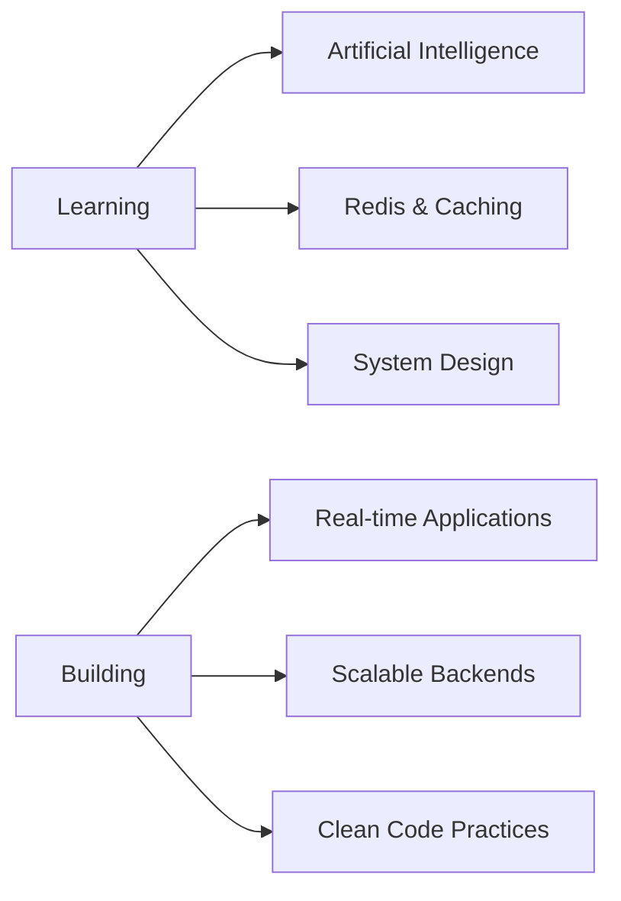

<div align="center">


[](https://anshulsharma.dev)
[](https://linkedin.com/in/anshulsharma29)
[](mailto:sharma.ansh2926@gmail.com)
[](https://leetcode.com/Anshul_Sharma29)


</div>

---

<div align="center">

## 🌟 About Me

</div>

```javascript
const anshul = {
    location: "Saharanpur, India 🇮🇳",
    education: "B.E. CSE @ Chitkara University | CGPA: 9.48/10",
    previousRole: "Web Developer Intern @ Cintamani Educational Society",
    currentlyLearning: ["Artificial Intelligence", "Redis", "System Design"],
    interests: ["Full-Stack Development", "Real-time Systems", "Clean Code"],
    askMeAbout: ["Java", "MERN Stack", "React.js", "Node.js", "REST APIs"],
    funFact: "I debug with console.log() and I'm not ashamed! 🐛"
};
```

---

<div align="center">

## 🏆 Achievements & Recognition

</div>

<table align="center">
<tr>
<td align="center" width="50%">

**🥇 JP Morgan Chase**  
*Code for Good 2025*

Selected among **150 finalists** from **50,000+ participants**  
Led frontend development | 40% sprint velocity boost

</td>
<td align="center" width="50%">

**🥈 Morgan Stanley**  
*Code-to-Give 2025*

**Top 4 Finalist Teams**  
Contributed to scalable backend architecture

</td>
</tr>
<tr>
<td align="center" width="50%">

**🎯 Yamaha**  
*Explore AI Hackathon*

Led team of 4 developers  
Delivered working prototype in 48 hours

</td>
<td align="center" width="50%">

**💻 LeetCode**  
*Active Problem Solver*

Strong DSA foundations  
Consistent problem-solving practice

</td>
</tr>
</table>

---

<div align="center">

## 💼 Featured Projects

</div>

<details open>
<summary><b>🎯 Plypt - Real-Time Bidding Platform</b></summary>
<br>

**Tech Stack:** `MERN` `Socket.io` `Redis` `Razorpay`  
**Duration:** Apr 2025 - Nov 2025

- 🔄 Real-time bidding with Socket.io and Redis for concurrency handling
- 💳 Secure payment integration with Razorpay
- ⚡ Optimized event-handling performance and race condition resolution
- 🎨 Reusable UI components for consistent design

[](https://github.com/Anshul-Sharma01/Plypt)

</details>

<details>
<summary><b>🤝 DevTogether - Developer Collaboration Platform</b></summary>
<br>

**Tech Stack:** `MERN` `Redux Toolkit` `Docker`  
**Duration:** Jan 2025 - Apr 2025

- 🔐 Authentication and real-time discussion modules
- 📦 State management with Redux Toolkit
- 🐳 Docker containerization for consistent deployments
- 👥 Code reviews and team collaboration workflows

[](https://github.com/Anshul-Sharma01/DevTogether)

</details>

<details>
<summary><b>🌍 Trips & Memories - Journey Documentation</b></summary>
<br>

**Tech Stack:** `MERN` `Cron Jobs` `JWT`  
**Duration:** Aug 2024 - Dec 2024

- 📝 Full-stack trip journaling with role-based access
- ⏰ Scheduled reveal functionality using cron jobs
- 🔒 Secure authentication and authorization
- 🎯 Optimized UI responsiveness

[](https://github.com/Anshul-Sharma01/Trips-and-Memories)

</details>

<details>
<summary><b>🔍 Hybrid Retrieval System</b></summary>
<br>

**Tech Stack:** `FastAPI` `Python` `Redis`  
**Duration:** Aug 2025 - Sept 2025

- 🐍 Python backend with FastAPI and clean architecture
- 🚀 Async processing for optimized performance
- 📊 Redis queues for background task management
- 🔧 Iterative testing for improved stability

[](https://github.com/Anshul-Sharma01/Hybrid-Retrieval-System)

</details>

<div align="center">

**🔗 More Projects:** [U-Laundry](https://github.com/Anshul-Sharma01/U-Laundry) • [Get-Me-A-Chai](https://github.com/Anshul-Sharma01/get-chai-project) • [URL-Shortener](https://github.com/Anshul-Sharma01/nanolinks-nextjs-project) • [Blog-io](https://github.com/Anshul-Sharma01/Blog-SPA-io)

</div>

---

<div align="center">

## 🛠️ Tech Arsenal

</div>

<div align="center">

### Languages


### Frontend


### Backend


### Databases


### Tools & Platforms


</div>

---

<div align="center">

## 📊 GitHub Analytics


</div>

---

<div align="center">

## 🎯 Current Focus



</div>

---

<div align="center">

## 💡 Code Philosophy

> *"Clean code is not written by following a set of rules. You know you are working on clean code when each routine you read turns out to be pretty much what you expected."*  
> — Robert C. Martin

</div>

---

<div align="center">

## 🤝 Let's Connect!

I'm always open to interesting conversations and collaboration opportunities!

[](https://discord.gg/anshulsharma_30663)
[](https://linkedin.com/in/anshulsharma29)
[](mailto:sharma.ansh2926@gmail.com)
[](https://anshulsharma.dev)

</div>

---

<div align="center">

### 💭 Random Dev Quote


</div>

---

<div align="center">

### 🐍 Contribution Snake


</div>

---


<div align="center">

### ⭐️ From [Anshul Sharma](https://github.com/Anshul-Sharma01)

**Thanks for visiting! Feel free to star ⭐ repositories you find interesting!**

</div>
